# 🌐 AetherNet: A Full-Stack Solana DePIN Project

AetherNet is a complete decentralized physical infrastructure network (DePIN) project built on the **Solana** blockchain. It showcases a full-stack, scalable architecture combining an **Anchor (Rust) smart contract**, a high-performance **Rust indexer and REST API**, and a modern **Next.js** frontend.

This repository serves as a comprehensive template for developers looking to build and deploy robust, real-world dApps on Solana.

🔗 **Live Demo:** [**AetherNet-DePin**](https://aethernet-depin.vercel.app/)

---

## 📸 Demo


---

## ✨ Features

* **On-Chain Node Registry:** Users can register and deregister their physical devices on the Solana blockchain.
* **SPL Token Staking:** Node registration requires staking a specific SPL token, which is returned upon deregistration.
* **High-Performance Indexer:** A background service built in Rust (`sqlx`, `tokio`) listens to on-chain accounts and syncs their state to a PostgreSQL database in near real-time.
* **REST API:** A scalable REST API built with Rust and **Axum** serves the indexed on-chain data to any client.
* **Reactive Frontend:** A modern dApp built with **Next.js**, TypeScript, and Tailwind CSS provides a seamless user interface for wallet connection, node management, and viewing network stats.
* **Full User Lifecycle:** Complete flow for users to register, view their registered node, and deregister.
* **Scalable by Design:** The architecture separates on-chain logic from off-chain data querying, ensuring the UI remains fast and responsive, regardless of how many nodes are on the network.

---

## 🏗️ Project Architecture
AetherNet is designed with a scalable, multi-tiered architecture that separates on-chain logic from off-chain data services. This ensures that the user interface remains fast and responsive, regardless of the amount of data on the blockchain.

The system is composed of three core components: the Solana Program, the Indexer & API Service, and the Frontend dApp.

```mermaid
graph TD
    subgraph "Browser"
        A["🌐 Frontend dApp <br>(Next.js)"]
    end

    subgraph "Backend Services"
        B{"🚀 REST API <br>(Rust/Axum)"} --- E[("🐘 PostgreSQL DB")]
        C["🔄 Indexer <br>(Rust/SQLx)"] --> E
    end

    subgraph "Solana Blockchain (Localnet/Devnet)"
        D["⛓️ Solana Program <br>(Anchor/Rust)"]
    end

    A -- " Fetches node data via HTTP GET" --> B
    A -- " Sends transactions (register/deregister)" --> D
    C -- " Polls for account changes" --> D

    style A fill:#0d1117,stroke:#30a0e0,stroke-width:2px
    style B fill:#0d1117,stroke:#f0a030,stroke-width:2px
    style C fill:#0d1117,stroke:#f0a030,stroke-width:2px
    style D fill:#0d1117,stroke:#9030f0,stroke-width:2px
    style E fill:#0d1117,stroke:#30e0a0,stroke-width:2px
```



#  Solana Program (Current Repo)
* Technology: Rust with the Anchor Framework.

* Responsibility: This is the on-chain heart of the application. It defines the core logic and the structure of the data accounts (NodeDevice, NetworkStats).

**Key Functions:**

* register_node: Creates a NodeDevice account for a user and stakes their SPL tokens.

* deregister_node: Closes the NodeDevice account and returns the staked tokens.

* initialize_network: Sets up the initial state for the network.

# Indexer & API Service

A Rust-based indexer that connects to the Solana blockchain, listens for on-chain events, and stores structured data in PostgreSQL.

* Written in Rust with SQLx for database handling

* Ensures efficient synchronization of blockchain state with off-chain storage

* Provides reliable data for the API layer

* github link : [**Indexer Repo**](https://github.com/ktan-wolf/Indexer) 

* Technology: Rust with Tokio, SQLx (for database), and Axum (for the API).

**Responsibility** 

* This service acts as the bridge between the on-chain world and the frontend, providing fast and efficient data access. It runs as two concurrent tasks:

* The Indexer: A background task that continuously polls the Solana blockchain for all accounts owned by our program. It deserializes the raw account data into a structured format and "upserts" it into a PostgreSQL database. This keeps the database in sync with the blockchain state.

* The REST API: An Axum web server that exposes endpoints (e.g., /nodes) for the frontend to query. Instead of hitting the blockchain directly for data, the frontend asks this API, which reads directly from the fast, indexed PostgreSQL database.

# Frontend dApp

* A Next.js + TypeScript application serving as the main user interface.

* Built with React, Next.js, TailwindCSS

* Connects directly to Solana wallets and the backend API

* Displays live DePIN data from the indexer

* Designed for scalability and a smooth developer experience

* github link : [**Dapp Repo**](https://github.com/ktan-wolf/Dapp) 

* Technology: Next.js, React, TypeScript, and Solana Wallet Adapter.

* Responsibility: This is the user-facing application.

**Key Interactions**

* Reading Data: It fetches the list of all registered nodes by making a simple HTTP request to the Rust API (https://indexer-o06a.onrender.com/nodes), ensuring the page loads instantly.

* Writing Data: When a user wants to perform an action that changes state (like registering or deregistering a node), it uses the connected wallet to build, sign, and send a transaction directly to the on-chain Solana program.

## ⚡ Tech Stack

* **Blockchain**: Solana, Anchor, Rust

* **Backend**: Rust (Axum for API, SQLx for DB, Tokio for async)

* **Frontend**: Next.js, React, TypeScript, Tailwind CSS, Solana Wallet Adapter

* **Database**: PostgreSQL

* **DevOps**: Docker, Yarn, ts-mocha, chai

## 🚀 Local Development Setup

Follow these steps to set up and run the entire AetherNet stack on your local machine.

### 1. Prerequisites
Make sure you have the following installed:
* Node.js (v18 or higher)
* Yarn (`npm install -g yarn`)
* Rust & Cargo
* Solana CLI
* Anchor CLI
* PostgreSQL Client (`psql`)
* Docker

### 2. Clone and Install
```bash
# Clone the repository (or repositories)
git clone [https://github.com/ktan-wolf/AetherNet-DePIN](https://github.com/ktan-wolf/AetherNet-DePIN)
cd aethernet-depin

# Install all Node.js dependencies
yarn install
```

### 3. Start the Database
```bash
# Start a PostgreSQL container in the background
docker-compose up -d

# Wait a few seconds, then apply the database schema
psql -h localhost -U aethernet_user -d aethernet -f migrations/schema.sql
```

### 4. Build and Deploy Solana Program
This will start a local validator, deploy the program, and run tests which create a necessary SPL Token mint.

```bash
# Start a local Solana validator in a separate terminal
solana-test-validator

# In your main terminal, build and deploy the program
anchor build
anchor deploy
```

### 5. Start the Services
Open two more separate terminals for the indexer and the frontend.

**Terminal 1: Start the Indexer & API**
```bash
git clone [https://github.com/ktan-wolf/Indexer](https://github.com/ktan-wolf/Indexer)
cd indexer
cargo run
```
> You should see logs indicating a successful connection to both Solana and the database, and the API server listening on `http://localhost:8081`.

**Terminal 2: Start the Frontend dApp**
```bash
git clone [https://github.com/ktan-wolf/Dapp](https://github.com/ktan-wolf/Dapp)
cd dapp
pnpm install
pnpm dev
```
> Your Next.js application will now be running at `http://localhost:3000`.

You're all set! Open your browser to `http://localhost:3000` to use the dApp. You will need a Solana wallet (only Phantom) connected to your local network.

---

## 🤝 Contributing

Contributions, issues, and feature requests are welcome! Feel free to check the [issues page](https://github.com/ktan-wolf/aethernet-depin/issues).

---

## 📜 License

This project is licensed under the MIT License. See the `LICENSE` file for details.